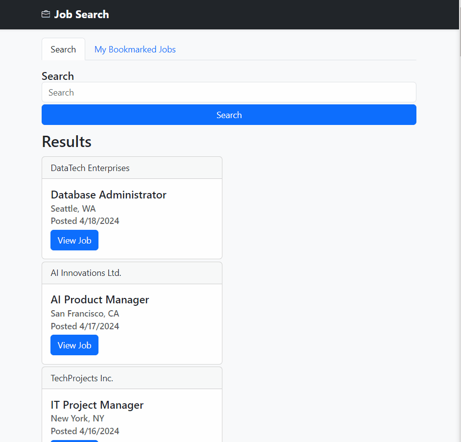
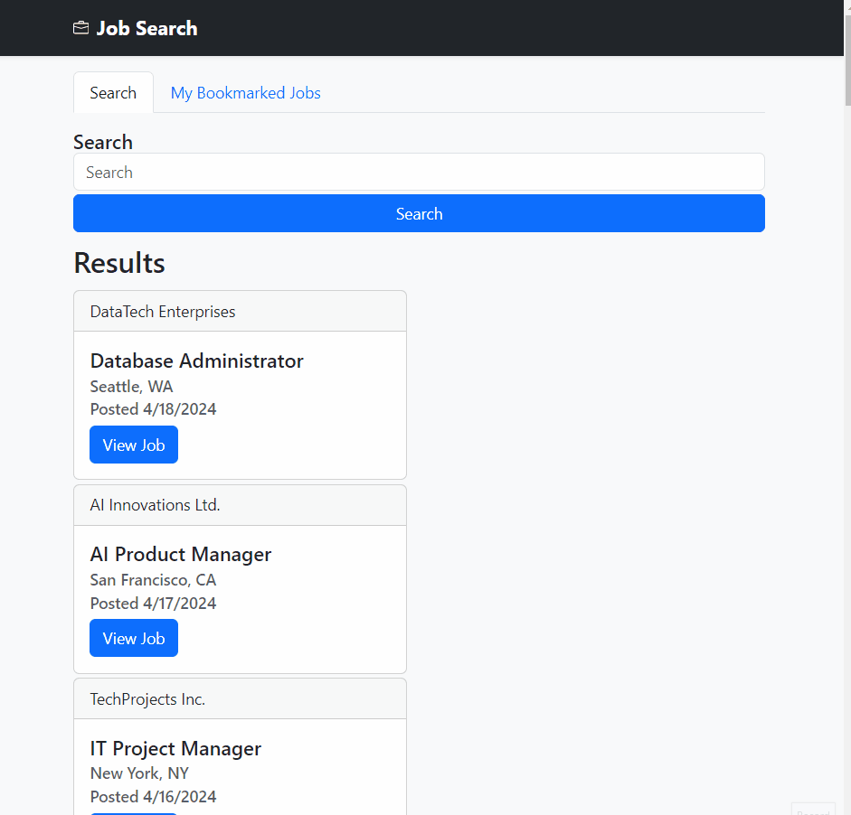

# Assignment 1 - Job Search App

This assessment consists of a simple job search app that allows users to search for jobs using a custom backend API that we have created.

You will be assessed on your knowledge of the following:
- running a backend server
- making GET API requests to the server
- displaying the data on the front end using the DOM.
- handling user input

## Steps

1. Open a terminal and run your backend server reference [the backend documentation here](backend/README.md).

2. Open a new terminal and create an npm project in the `frontend` folder so your `package.json` file is next to the `index.html` file.
Note: This is for the automated testing environment to work correctly.

3. Install the following dependencies.
- bootstrap
- parcel
Note: These should be present in your `package.json` file.

4. Set up Parcel properly to run your front-end application and add a script to run the application.

5. Import bootstrap in your `index.js` file.
```js
import 'bootstrap/dist/css/bootstrap.min.css'
```

6. Intercept and handle the form submission event, and make a GET request to the back-end server to get the jobs. This should be completed by a function in the `api/jobs.js` file.
Note:
- It is preferred (for the automated testing to pass correctly) that you use the ["SEARCH (GET) Jobs"](./backend/README.md) get job endpoint to do this.
- It is less preferred to do the searching on the front-end but it is acceptable if you do it this way.

7. Display jobs on the front end using the DOM; loop through the jobs that were fetched and display them in a card format. You should be updating the element with the following HTML template.
```html
<li class="job-card card my-1" style="width: 18rem;">
  <div class="card-header">JOB COMPANY HERE</div>
  <div class="card-body">
    <h5 class="card-title">JOB TITLE HERE</h5>
    <h6 class="card-subtitle mb-2 text-body-secondary">JOB LOCATION HERE</h6>
    <h6 class="card-subtitle mb-2 text-body-secondary">Posted FORMATTED JOB DATE HERE</h6>
    <button class="btn btn-primary view-job-button" job-data-id="JOB ID HERE">View Job</button>
  </div>
</li>
```
- If there are no results you should display the following message.
```html
<div class="text-dark">No Results Found</div>
```

8. Add an event listener to the list of jobs that will allow the user to view the job details.
Note:
- Observe the `view-job-detail` class on the button; you'll need to use this to handle the event.
- The job id is stored in the `job-data-id` attribute from the previous step.

9. When the user clicks on the "View Job" button, make a GET request to the backend server to get the job details (this should be a function in the `api/jobs.js` file), and display the jobs on the front end using the DOM on the element with the id of `job-details-card`.
- use the following HTML template to display the job details.
```html
<div class="card">
  <div class="card-body">
    <h3 class="card-title">JOB TITLE HERE</h5>
    <h4 class="card-subtitle mb-2 text-body-secondary pb-3">JOB COMPANY HERE</h6>
    <h6 class="card-subtitle mb-2 text-body-secondary ">JOB LOCATION HERE</h6>
    <h6 class="card-subtitle mb-2 text-body-secondary pb-3">Posted JOB POSTED DATE HERE (FORMATTED)</h6>
   
    <h5 class="card-subtitle mb-2">Description</h5>
    <p class="card-text">JOB DESCRIPTION HERE</p>
    <h5 class="card-subtitle mb-2">Qualifications</h5>
    <p class="card-text">JOB QUALIFICATIONS HERE</p>
    <button class="btn btn-success save-job">
      <svg xmlns="http://www.w3.org/2000/svg" width="16" height="16" fill="currentColor" class="bi bi-bookmark" viewBox="0 0 16 16">
        <path d="M2 2a2 2 0 0 1 2-2h8a2 2 0 0 1 2 2v13.5a.5.5 0 0 1-.777.416L8 13.101l-5.223 2.815A.5.5 0 0 1 2 15.5zm2-1a1 1 0 0 0-1 1v12.566l4.723-2.482a.5.5 0 0 1 .554 0L13 14.566V2a1 1 0 0 0-1-1z" />
      </svg>
      Save Job
    </button>
  </div>
</div>
```
10.  Ensure that all the jobs are displayed when the page is loaded. So it should make the get request to the REST API endpoint for jobs and render all of the cards (please refer to the example functionality GIF below).
Note: this should be using the ["GET all Jobs"](./backend/README.md) endpoint.

## Example functionality

Please refer to the following GIF to see the expected functionality of the application.




## Bonus (only attempt this if you are done with the above steps)

- The functionality needs to save the jobs to the back-end server and list the jobs when you're in the saved jobs tab. PS. do not ask your instructor for help as this is a bonus. Refer to the GIF below for functionality.




## Challenge (only attempt this if you have way too much time on your hands)

_Challenges_ are not graded, please don't ask your instructor for help. This is a challenge for those of you who want to push further.

- Implement a "delete job" functionality that will require an express endpoint to delete a job by job id.
- Implement more filtering functionality like dates, job type, and location.

## Marking Key

| Marks | Tasks |
|------------------|------------------|
| 5 | Setup the project properly with the correct dependencies and scripts. |
| 3 | Functionality uses modules correctly and creates functionality in the correct files. |
| 5 | Fetch API functions are created correctly 
| 5 | Displays the jobs on the frontend using the DOM and visually looks the same as the Example functionality |
| -5 | Project runs without errors |
| -3 | Code is clean and well-organized |
| 3 (Bonus) | Bonus marks: Save jobs using the backend and display them in the proper area. |

## Marking Rubric
### 5 marks
| Marks | 5 marks Criteria |
|------------------|------------------|
| 5 | Task was completed with the highest of proficiency adhering to best practices and followed subject matter guidelines all tasks were completed to a professional standard. |
| 4 | Task was completed well some minor mistakes. Well above average work shows good understanding of the task and high degree of competence |
| 3  | Satisfactory work some features missing or incorrectly implemented. Show a moderate level of understanding in the task with room for improvement. |
| 2  | Below average work. Task was poorly complete. Show understanding of the task and the requirements to implement but implementation was poorly executed. |
| 1  | Some of the task was completed. Showed a lack of understanding in the subject matter and very poorly executed. |
| 0  | Not completed. |

### 3 marks
| Marks | 3 marks Criteria |
|------------------|------------------|
| 3 | Proficient shows a high degree of competence in completing task. |
| 2 | Capable, above-average degree of competence in completing the task. |
| 1 | Satisfactory shows a satisfactory degree of competence in completing the task. | 
| 0 | Shows a limited degree of competence in completing the task. |
 

### 2 marks

| Marks | 2 marks Criteria |
|------------------|------------------|
| 1 | Task Completed satisfactorily   |
| 0 | Task was not executed. |
 

### Negative Marks

Negative marks will be given for the assignment at the discretion of the instructor with a maximum of -5 marks for this assignment. The default will be 0 if it is correct.
